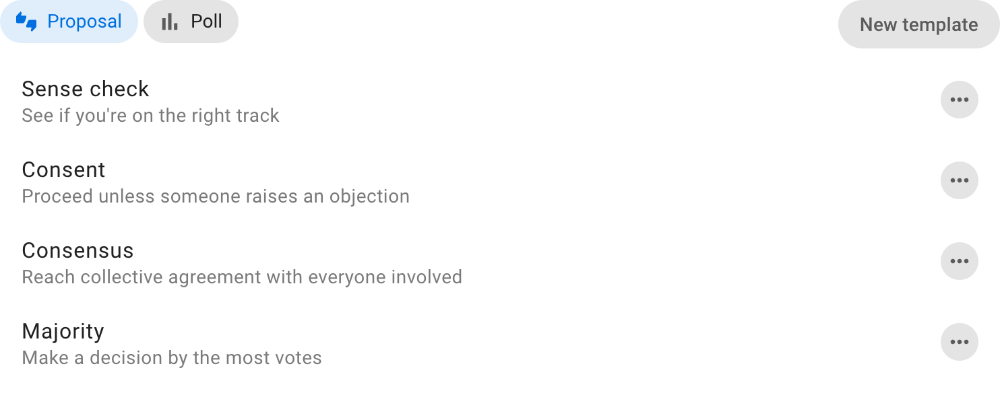

# Proposals

A proposal asks people to respond to a statement or course of action. Participants choose a defined response and can explain their vote. Use a proposal to gather feedback, seek advice, identify objections, or test for agreement.

This section helps you choose and run Loomio's default proposal templates. For a complete sequence of discussion, proposals, amendments, and outcome, use the [decision-making guides](/en/guides/making_decisions/). To change the templates available to your group, see [Poll templates](../poll_templates/).

## Choose a proposal template

| Template | What it asks | Use it when… |
|---|---|---|
| [Sense check](sense_check/) | Is this on the right track? | An idea is still being developed |
| [Advice](advice/) | What advice should the decision maker consider? | A person or team owns the decision |
| [Consent](consent/) | Is this safe to try, or is there a meaningful objection? | The group uses consent decision-making |
| [Consensus](consensus/) | What is your position on this proposal? | The group is seeking collective agreement |

Choose the template whose response options match the question you need answered. Each template page explains its use cases, setup, voting form, and results.

## Other proposal templates

Loomio also provides templates such as Proposal, Gradients of agreement, Question round, and Majority. Some are hidden initially. Group administrators can make them available or create a template for the group's own terminology and rules from [Poll templates](../poll_templates/).

## Proposal records

Votes and reasons update while the proposal is open, and participants can change their response. After it closes, publish an [outcome](../outcomes/) that states the decision or next step. The discussion, proposal, votes, reasons, and outcome form a record of how the group reached its decision.
