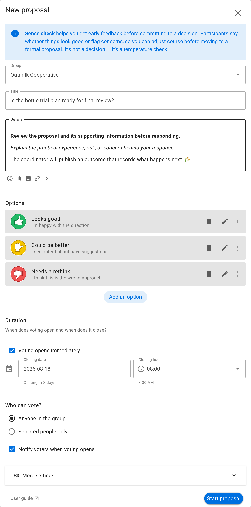
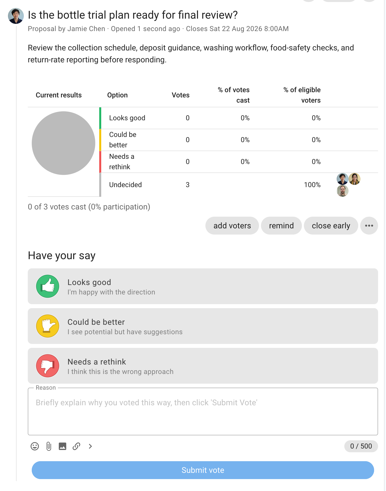
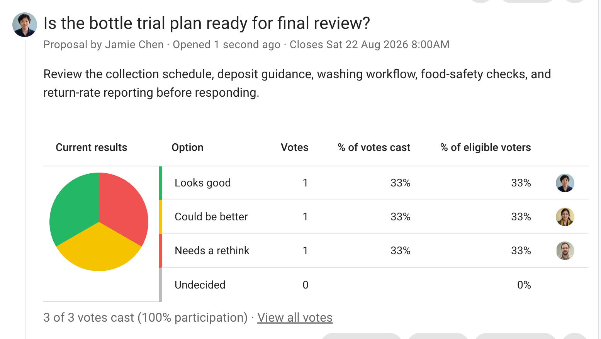

# Sense check

Sense check gathers reactions while an idea is still being developed. Its options—**Looks good**, **Could be better**, and **Needs a rethink**—show whether the group is ready to proceed or should revise the idea first.

This page explains how to run one Sense check. See the [Simple decision process](/en/guides/making_decisions/simple_decision_process), [Consent process](/en/guides/making_decisions/consent_process), or [Consensus process](/en/guides/making_decisions/consensus_process) for examples of using Sense check as one stage of a larger process.

## When to use Sense check

Use Sense check to:

- test an early draft before investing in a detailed proposal;
- uncover questions and concerns before a formal decision;
- check whether another round of discussion is needed; or
- compare support before and after revising an idea.

Do not treat **Looks good** as formal approval unless the group has explicitly agreed to do so. Use [Consent](../consent/) or [Consensus](../consensus/) when the response must authorize a decision.

## Example: check a trial plan

Oatmilk Cooperative has drafted a returnable-bottle trial. It runs a Sense check to learn whether the collection schedule, washing checks, and reporting plan are ready for final review.

## Set up the proposal

State what stage the idea has reached and what will happen with the feedback. Keep the default response meanings or edit them to match the group's language. Set a closing time that leaves enough time to revise the plan.

## Vote

Participants choose the response that best represents their current view and explain what is ready or what should change. A useful reason gives the proposal author something specific to act on.

## Read the results

The chart shows the number and proportion of votes for each response. Read the reasons as well as the distribution: one well-founded concern may require attention even when most participants select **Looks good**.

Publish an outcome that summarizes the changes the group will make, or records that the idea is ready for the next decision stage.
