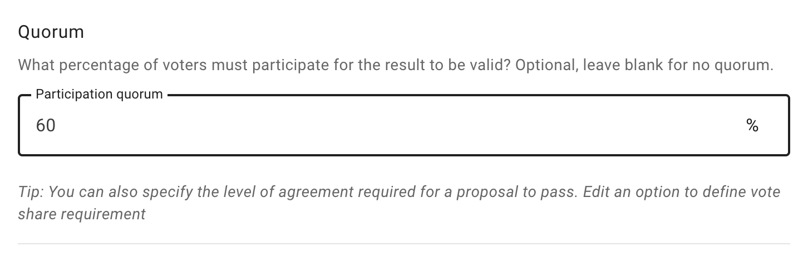
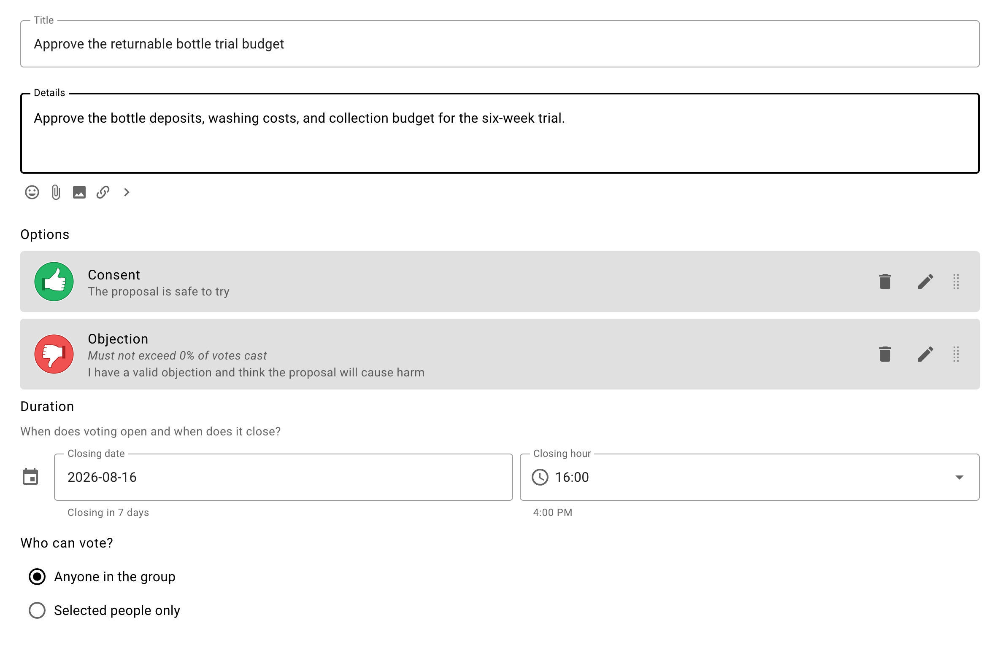
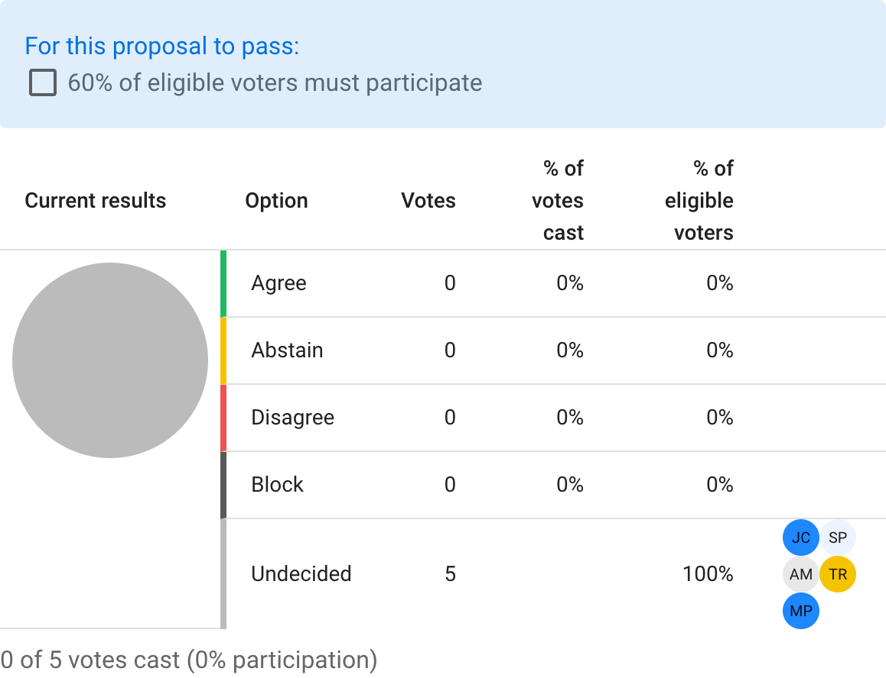
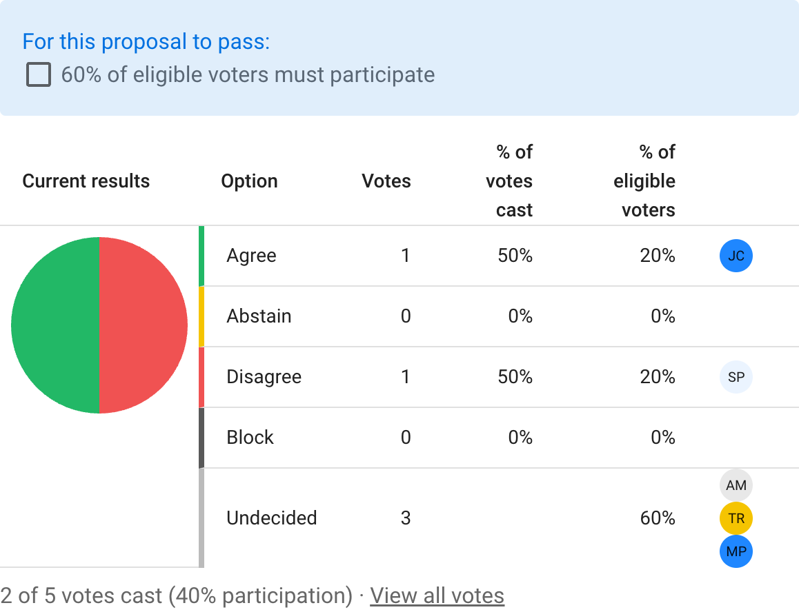
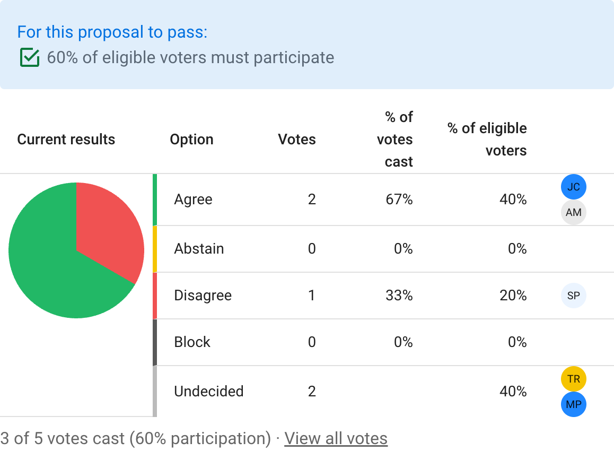

# Quorum

A quorum is the minimum percentage of eligible voters who must participate for a poll to be valid. Use it when your governance process requires a particular level of participation.

When creating a poll, open **More settings** and enter the required percentage in **Participation quorum**. Leave the field blank when no quorum is required.

You can also set a quorum in a [poll template](/en/user_manual/polls/poll_templates/) so that polls created from that template use it by default.

## Example scenario

Oatmilk Cooperative is discussing a six-week returnable bottle trial. The discussion has reached the point where the cooperative needs to approve the trial budget.

Jamie selects **Start a vote**, chooses the **Consent** proposal template, and completes the title, details, options, duration, and voter settings.

Jamie limits the vote to the five people responsible for the trial budget.

The cooperative requires 60 percent participation for significant decisions, so Jamie enters **60** in the participation quorum field and starts the proposal.

Before anyone votes, the results panel shows that the quorum has not been reached.

Jamie agrees and Samira disagrees. The chart updates, but two of five eligible voters is only 40 percent participation, so the quorum is still not reached.

Alex then agrees. Three of five eligible voters have participated, reaching the 60 percent quorum. The requirement now shows a green check mark. Jamie can close the poll early or wait for the remaining voters.

