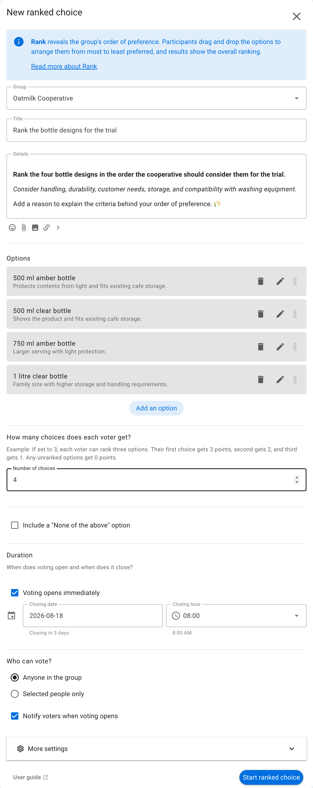
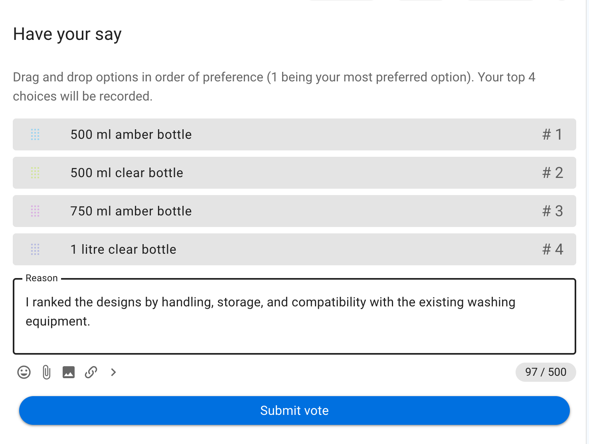
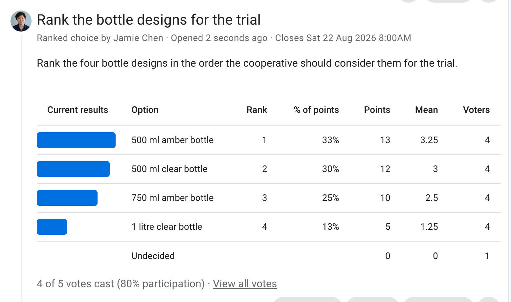

# Rank

Rank finds the group's overall order of preference. Participants arrange options from most to least preferred, and Loomio assigns more points to higher-ranked options.

## When to use Rank

Use Rank when preference order matters and you want one overall ordering. It works well for:

- selecting one candidate for a position;
- ordering projects for a work plan;
- prioritizing conference topics;
- choosing backup options as well as a first choice; or
- reducing a long list to an ordered shortlist.

Rank uses a points-based ordering. It is not a proportional election method. To elect several people while representing different groups of voters, use an [STV Election](/en/user_manual/polls/stv/).

## Example: rank bottle designs

Oatmilk Cooperative asks members to rank four bottle designs for its returnable-bottle trial. Participants consider handling, durability, customer needs, storage, and compatibility with the washing equipment.

## Set up the poll

State what the ranking will determine and add the options. Set **Number of choices** to control how many options each person may rank. A first choice receives the most points, the next choice receives one fewer, and unranked options receive no points.

Require all options to be ranked when you need a complete ordering. Allow fewer choices when participants may not know enough to rank everything. Showing options in random order can reduce the influence of their initial presentation.

## Vote

Participants drag the options into their preferred order, with number 1 as the first choice. They can add a reason explaining the criteria behind their ranking.

In this example, the voter puts the **500 ml amber bottle** first and the **500 ml clear bottle** second because both fit the existing cafe storage and washing equipment.

## Read the results

The results combine all ballots into an overall points-based ranking. For each option they show:

- **Rank**: its position in the combined result;
- **% of points**: its share of all ranking points;
- **Points**: the total points from all ballots;
- **Mean**: its average points per voter; and
- **Voters**: how many people ranked it.

In this example, the **500 ml amber bottle** ranks first, followed by the **500 ml clear bottle** and the **750 ml amber bottle**. The group can investigate the preferred design first while retaining the remaining order as a sequence of alternatives.

A points-based result can conceal different preference patterns that produce the same total. Review individual ballots and vote reasons when options are close or the decision is consequential.
