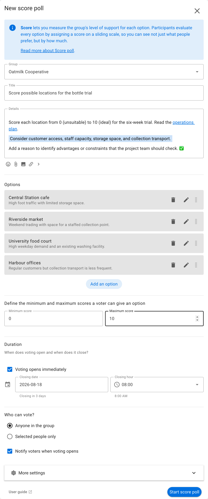
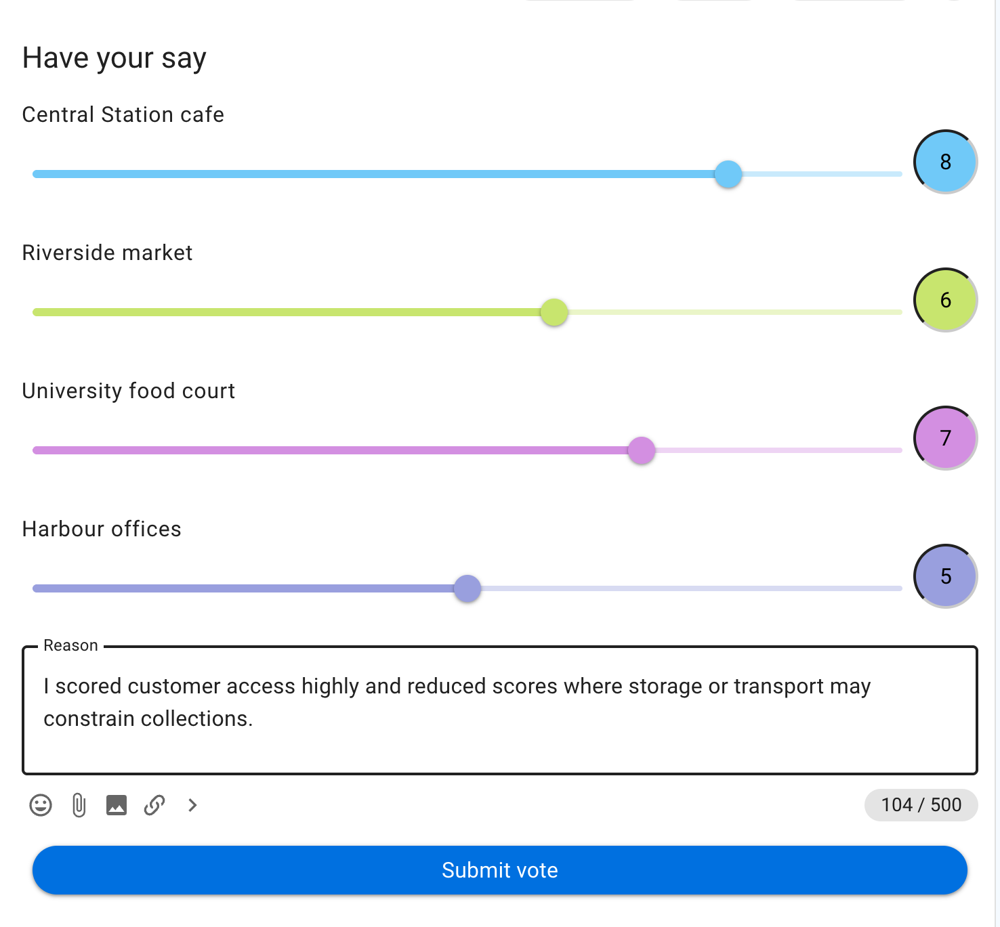
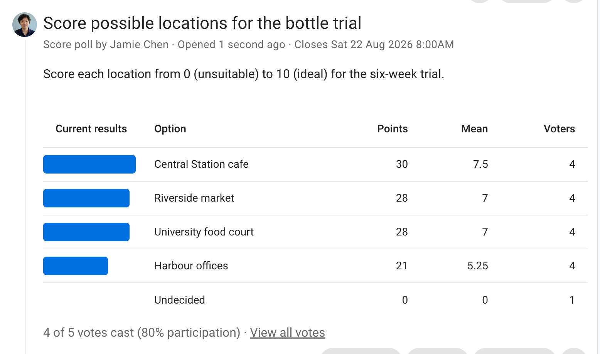

# Score

Score measures how participants evaluate each option on a shared numeric scale. Unlike Choose, it asks people to respond to every option, so the results show both what people prefer and how strongly they prefer it.

## When to use Score

Use Score when every option can be evaluated independently against the same question. It works well for:

- assessing how ready each part of a project is;
- rating the importance of several principles;
- measuring interest in possible meeting topics;
- evaluating grant applications against a common criterion; or
- comparing the suitability of several proposals.

Define what the bottom and top of the scale mean. A number without a shared definition can mean different things to different voters. Use [Choose](/en/user_manual/polls/choose/) when you only need selections, or [Allocate](/en/user_manual/polls/allocate/) when participants must make trade-offs within a limited budget.

## Example: score possible trial locations

Oatmilk Cooperative is choosing locations for a returnable-bottle trial. It asks members to score four locations from 0 (**unsuitable**) to 10 (**ideal**), considering customer access, staff capacity, storage, and collection transport.

## Set up the poll

State one question that applies equally to every option. Add the items to be assessed, set the **Minimum score** and **Maximum score**, and explain the endpoints in the details. Option meanings can clarify the scope of each item.

Choose a scale participants can apply consistently. A 0–5 scale is quick to use; a 0–10 scale allows finer distinctions. More precision does not necessarily produce better information, so use the shortest scale that fits the question.

Anonymous voting and showing options in random order can be useful when you want to reduce social or ordering effects.

## Vote

Participants move a slider to score every option. In this example, the voter scores Central Station cafe at 8, Riverside market at 6, the University food court at 7, and Harbour offices at 5.

The reason explains how the voter applied the scale. This helps the group distinguish a low score caused by missing information from one caused by substantive concern.

## Read the results

For each option, the results show:

- **Points**: the sum of all scores;
- **Mean**: the average score; and
- **Voters**: how many people scored the option.

In this example, **Central Station cafe** has the highest mean at 7.5. **Harbour offices** has the lowest mean at 5.25, while Riverside market and the University food court are tied at 7. Four of five invited people have voted, so the group can also see that one response is outstanding.

Compare means only when the options have a similar number of voters. Read the vote reasons before treating a small difference as meaningful, and publish an outcome explaining what action follows from the scores.
