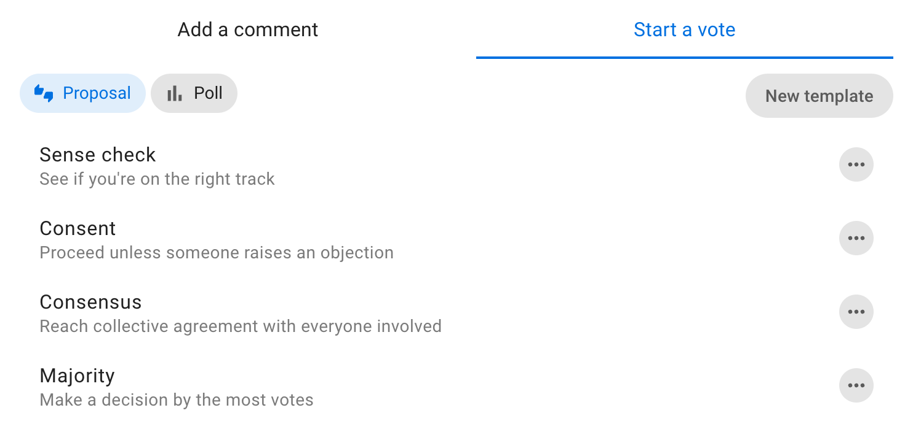
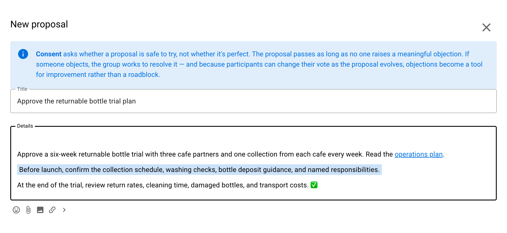
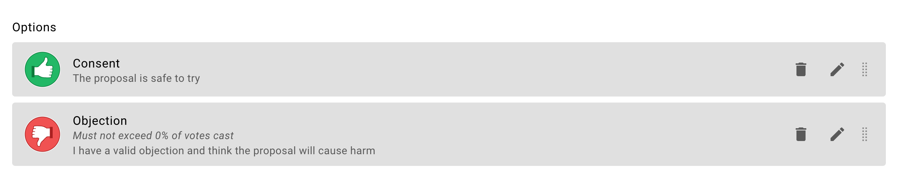
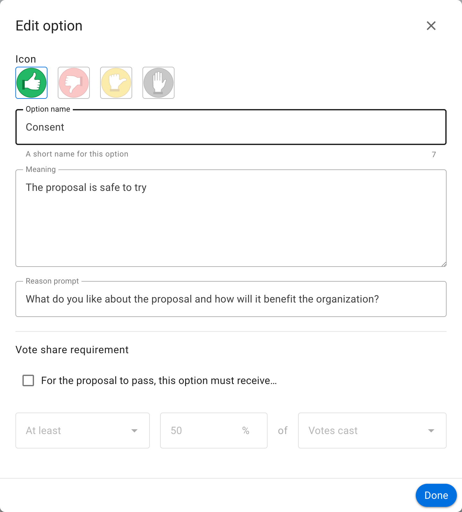
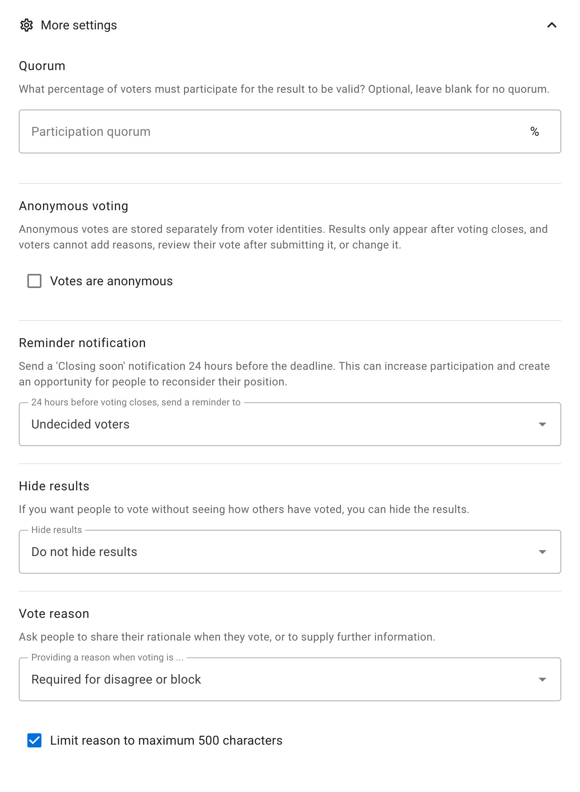
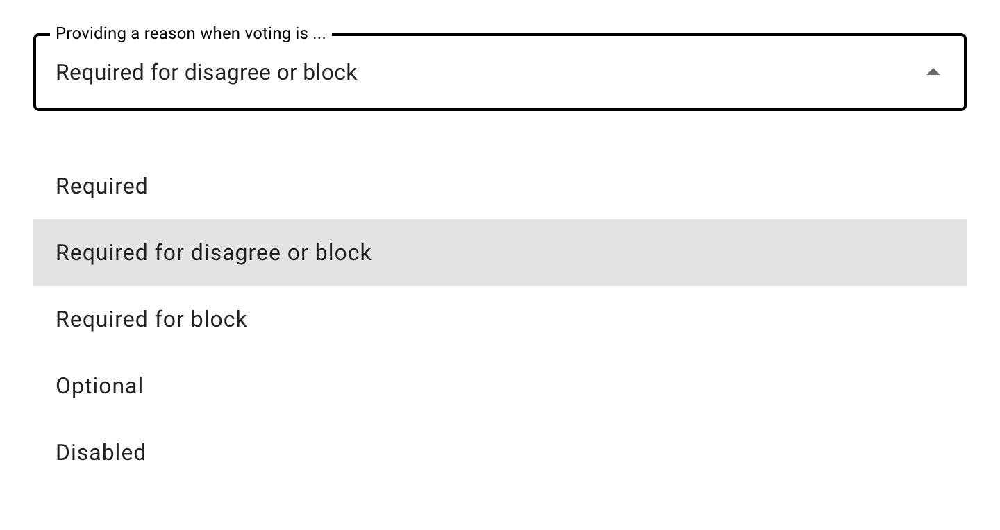
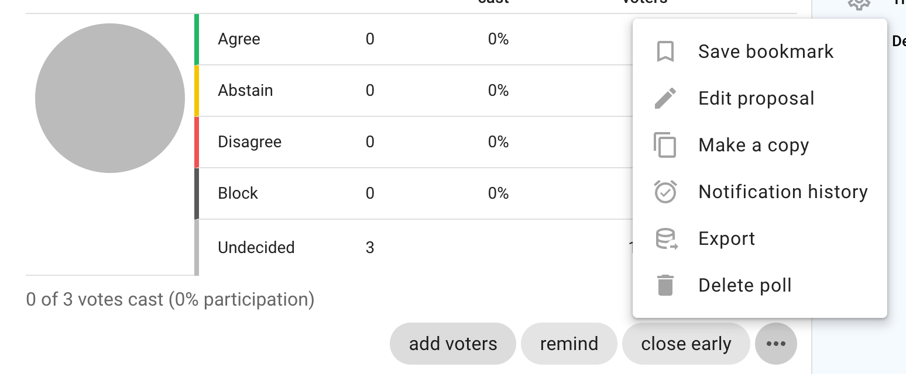
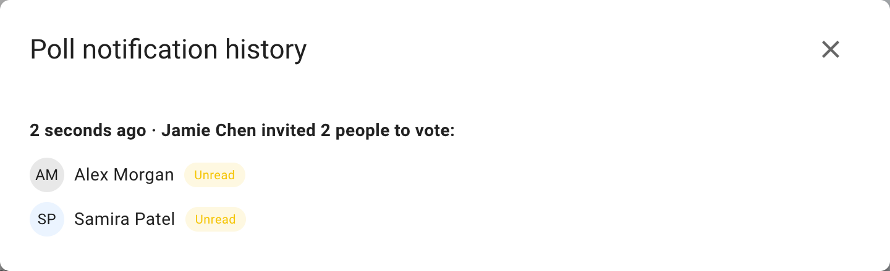
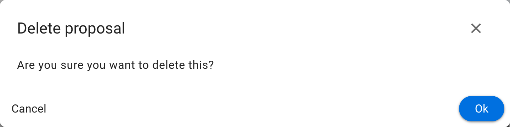

# Proposal and poll settings

## Setting up a proposal or poll

### Proposal and poll templates

Choose the proposal template you want to use. 

### Add content

**Group:** Check that the correct group is selected for your proposal or poll.

**Title:** Give your proposal or poll a short, relevant title.

**Details:** Explain what you are asking of people and include enough details so everyone knows what it means to vote.  

The predefined templates include some prompts to help you write a good proposal - use these or add your own details.

Avoid combining a range of ideas in one proposal, because people might agree to some aspects but not others and be unsure how to respond. You can break complex decisions down into multiple proposals.

When making a proposal, state your expectations and describe the impact the proposal will have if adopted. If it's a formal or binding proposal it's often worth describing what it means if the proposal is not adopted.

Use the formatting tools to support your poll.  For example, attach a document file with the paperclip icon, insert an image, link to a website or online document, or even embed a video.

### Voting options

Each proposal and poll template provides options for voting.

Depending on the template, you can edit, remove, reorder, or add voting options to suit the decision process you are running.

- Use the pencil icon to edit voting option 
- Use the trash can icon to remove unwanted voting options
- Use the handle to move the order of voting options
- Add voting options with **Add option** when the template allows custom options

### Edit voting options
There is a lot of flexibility to configure voting options to suit the way your organization makes decisions.

Use the pencil icon alongside the voting option to open the edit modal:

**Option name:** A short name for the option.

**Icon:** Select an icon for the option, such as thumbs up, thumbs down, abstain, or block.

**Meaning:** A sentence that explains what choosing this options means.

**Reason prompt:** A question to prompt voters to provide their reasoning or reconsider their position. 

### Opening time

By default, voting opens immediately when you create the poll. If you want to schedule voting to open at a later time, uncheck **Voting opens immediately** and select an opening date and time.

This is useful to give time for discussion before voting opens, or to ensure a poll or proposal is correctly set up and scheduled to happen at the right time.

When a poll has a scheduled opening time, you can add voters before voting opens. Voters will be notified when voting opens, rather than when they are added.

**Notify voters when poll opens:** When checked (default), all voters will receive a notification when voting opens. Uncheck this if you want to open voting without sending notifications.

**Closing date and time:** Select the closing date and time for your poll.

Give sufficient time for people to vote. You could time the proposal so it closes before a meeting, or avoid closing over a weekend, so that people will receive a timely reminder. If necessary, you can close the poll early or extend the closing time.

**Who can vote?** Invite everyone in the group or only specific people that you invite.

You can later add people to an 'Invite people only' poll. For identified polls,
you can also remove people who should no longer be eligible to vote. People
cannot be removed from an anonymous poll.

## More settings

### Reminder
Send a 'Closing soon' notification 24 hours before the poll closes. This can be an opportunity for people to see how others have voted and reconsider their own vote, or just a way to increase participation in the poll.

Setting options:
- Nobody
- Author
- Undecided voters (default)
- All voters

For an anonymous poll lasting at least 24 hours, Loomio automatically reminds
eligible people who have not voted during the final 24 hours. This reminder
cannot be changed in the poll settings.

### Anonymous voting
If enabled, votes are stored separately from voter identities. Results appear after voting closes, and voters cannot add reasons, review their submitted vote, or change it.

> [!WARNING]
> Once a poll has started you cannot edit the poll to make it anonymous or to undo the anonymous setting.

> [!WARNING]
> You cannot re-open an anonymous poll after it has closed. Submitted votes are not linked to the participation records that show who has voted.

### Vote reason
It can be helpful to understand why people voted the way they did. With this setting, you can prompt people to share their thoughts when they vote.

Available settings depend on the template:

- **Optional** lets voters choose whether to give a reason
- **Required for disagree or block** requires a reason when the selected option
  uses the Disagree or Block voting icon
- **Required for block** requires a reason when the selected option uses the
  Block voting icon
- **Required** requires every voter to give a reason
- **Disabled** removes the vote-reason field

The conditional settings follow the voting icon rather than the option name.
They still apply if you rename Disagree to a term such as Objection. The
Consent template defaults to **Required for disagree or block**, while the
Consensus template defaults to **Required for block**. Other templates default
to **Optional**, except Question rounds where the response itself is required.
The poll author can change the setting for an individual poll.

**Limit reason to maximum 500 characters:** Keeping vote reasons short makes them easier to understand. A collection of concise reasons is a great resource for making a decision.  This setting is ticked by default. Untick to allow for longer reasons.

### Hide results
If you want people to vote without knowing how others have voted, you can hide the results of the poll.  Useful if you do not want people to be affected by how other people have voted.

Setting options:
- Do not hide results
- Hide results until a vote is cast
- Hide results until voting closes

Anonymous polls always hide results until voting closes. The STV Election
template enables anonymous voting by default.

### Start the poll
Select the **Start proposal** or **Start poll** button.

## Managing polls

Open the three-dot menu at the bottom right of the poll.

### Edit poll

Use **Edit poll** to edit poll content or settings.   You can not change voting options once voting commences.

### Make a copy

Use **Make a copy** to create a new poll using the current poll and settings as a starting point.

### Notification history

**Notification history** shows who was notified and whether each notification has been read.

### Export poll

**Export** poll status and results to a spreadsheet (.csv) file, to download unformatted poll data for analysis or archive.

### Print

Use **Print** in the thread actions to open a printable HTML document. You can print it or save it as a PDF for publishing and archiving.

### Delete

**Delete** will delete the poll.  You will first be asked to confirm you want to delete the poll.

Make sure you want to delete the poll.  There is no 'restore' option.

After deletion, an **Item removed** marker remains in the thread.

### Save bookmark

Use **Save bookmark** to add the poll to your bookmarks for quick access later.
