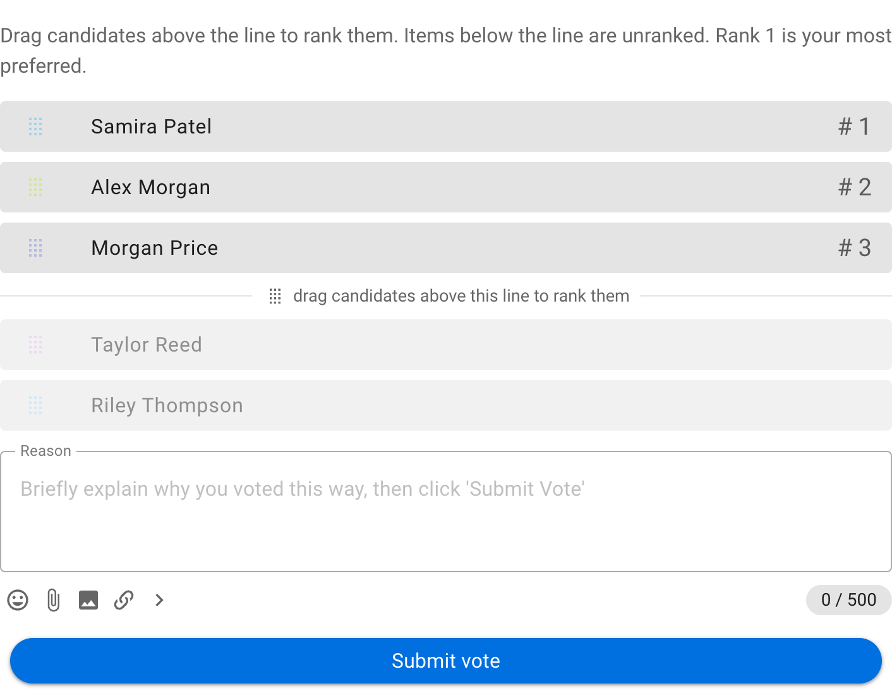
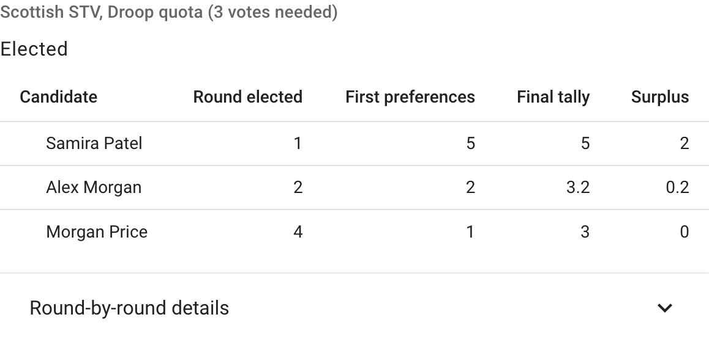
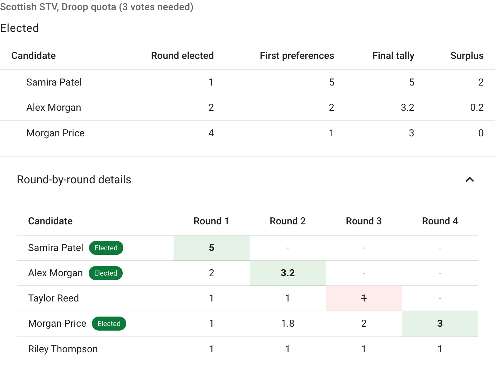

# STV Elections

**Single Transferable Vote (STV)** is a proportional representation voting method for electing multiple winners from a field of candidates. It ensures that elected candidates proportionally represent the diversity of views among voters.

STV is widely used by organizations like DSA, YDSA, cooperatives, unions, and local governments (e.g., Scotland, Ireland, and Australia) to run fair multi-winner elections.

## When to use STV

Use an STV Election when you need to:

- Elect a **committee, board, or slate of delegates** from a pool of nominees
- Ensure **proportional representation**, where minority factions can win seats proportional to their support
- Run elections where voters rank candidates by preference

>[!NOTE]
>STV is **not** the same as Loomio's ["Ranked Choice" poll](https://help.loomio.com/en/user_manual/polls/proposal_types/index.html#ranked-choice), which is a simpler score-based ranking for choosing a single best option. STV handles multi-winner elections with vote transfers and elimination rounds.

## Creating an STV Election

When starting a poll, select **STV Election** as the poll type, then add the candidates as the poll options. You can customize the poll by setting the **number of seats**, the **counting method**, and the **quota type**.

### Number of seats

How many winners should be elected. Must be less than the number of candidates.

### Counting method

There are two available methods for counting the votes:

Scottish STV
  : Recommended. The Weighted Inclusive Gregory Method (WIGM) used in Scottish local elections since 2007. Well-defined, straightforward rules. Best for most organizations.
  
Meek STV
  : A more mathematically precise iterative method. When a candidate is eliminated, votes are recounted as if that candidate was never in the race.

### Quota type

The quota is the minimum number of votes a candidate needs to win a seat. It can be either:

Droop
  : Recommended. The standard quota type for most STV elections, and used by Ireland, Australia, and Scotland. Droop guarantees a majority coalition wins a majority of seats. It is calculated as:
\\[ floor(\frac{votes}{(seats + 1)}) + 1 \\]

Hare
  : A higher minimum threshold, and more proportional for smaller factions.
    Hare is preferred by DSA chapters to protect minority representation.
   It is calculated as:
    \\[ \frac{votes}{seats}\\]
  
  >[!TIP]
  > Droop will always compute to a smaller number of votes than Hare. For example, in an election with 100 votes and four seats, the Droop quota would be 21 and the Hare quota 25.

## How voting works

In this example, Oatmilk Cooperative is electing three people to oversee the reusable packaging trial. Voters drag candidates above the line and rank them in order of preference:

- **Rank 1** = most preferred candidate
- **Rank 2** = second choice
- Continue ranking as many candidates as desired

Voters are not required to rank every candidate. Unranked candidates will not receive any of that voter's support.

## How counting works
The count is performed as follows:

1. A **quota** is calculated (minimum votes needed to win a seat).
2. **First preferences** are counted for each candidate.
3. If a candidate meets the quota, they are **elected**. Their surplus votes (above the quota) are **transferred** to voters' next preferences at a fractional value.
4. If no candidate meets the quota, the candidate with the **fewest votes is eliminated**. Their votes transfer to voters' next preferences at full value.
5. This process repeats until all seats are filled.

>[!TIP]
>If a voter has ranked no remaining candidates, their ballot is "exhausted" and that vote is lost. This is why ranking more candidates is generally better.

## Understanding results

After the poll closes, results are displayed in several sections. In this election, Samira Patel, Alex Morgan, and Morgan Price fill the three committee seats:

### Method and quota

At the top, you'll see the counting method (Scottish STV or Meek STV) and quota type (Droop or Hare) along with the quota — the number of votes a candidate needed to win a seat.

### Elected candidates

A summary table of the winners with five columns:

| Column | Meaning |
|--------|---------|
| **Candidate** | The name of the elected candidate |
| **Round elected** | Which counting round they reached the quota and won a seat. Round 1 means they won on first preferences alone; higher rounds mean they needed transferred votes from eliminated or surplus candidates. |
| **First preferences** | How many voters ranked this candidate as their first choice. This shows a candidate's direct support before any vote transfers. |
| **Final tally** | The candidate's vote tally at the moment they were elected. Due to vote transfers, this is often higher than their first preferences. |
| **Surplus** | How much the candidate's final tally exceeded the quota (final tally minus quota). A larger surplus means stronger support beyond what was needed to win. In Scottish STV, this surplus is redistributed to voters' next preferences. |

If the count results in a tie — where eliminating any of the remaining candidates would change the outcome — those candidates are shown in a separate table rather than arbitrarily choosing a winner.

### Round-by-round details

Expand **Round-by-round details** to see vote transfers and eliminations. Each row is a candidate and each column is a counting round:

The green highlight shows when a candidate was elected, red shows when they were eliminated, and orange shows when they tied.
