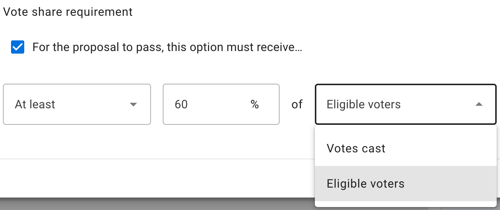
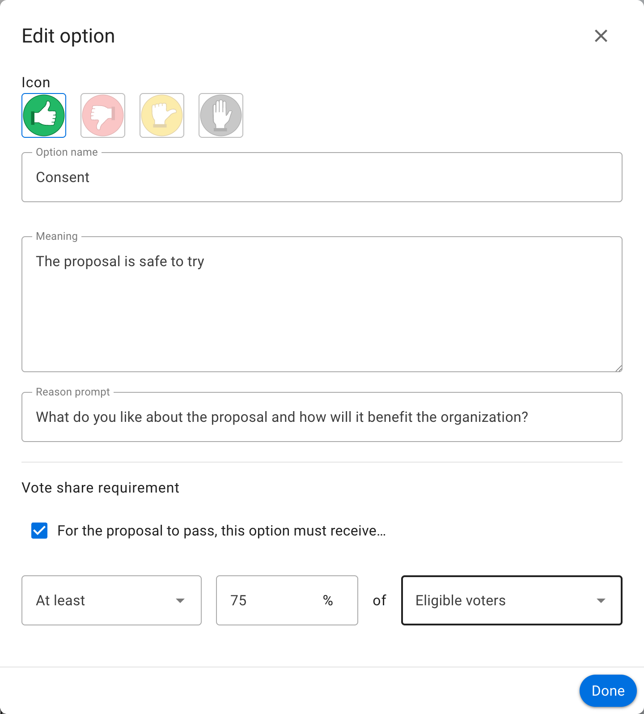
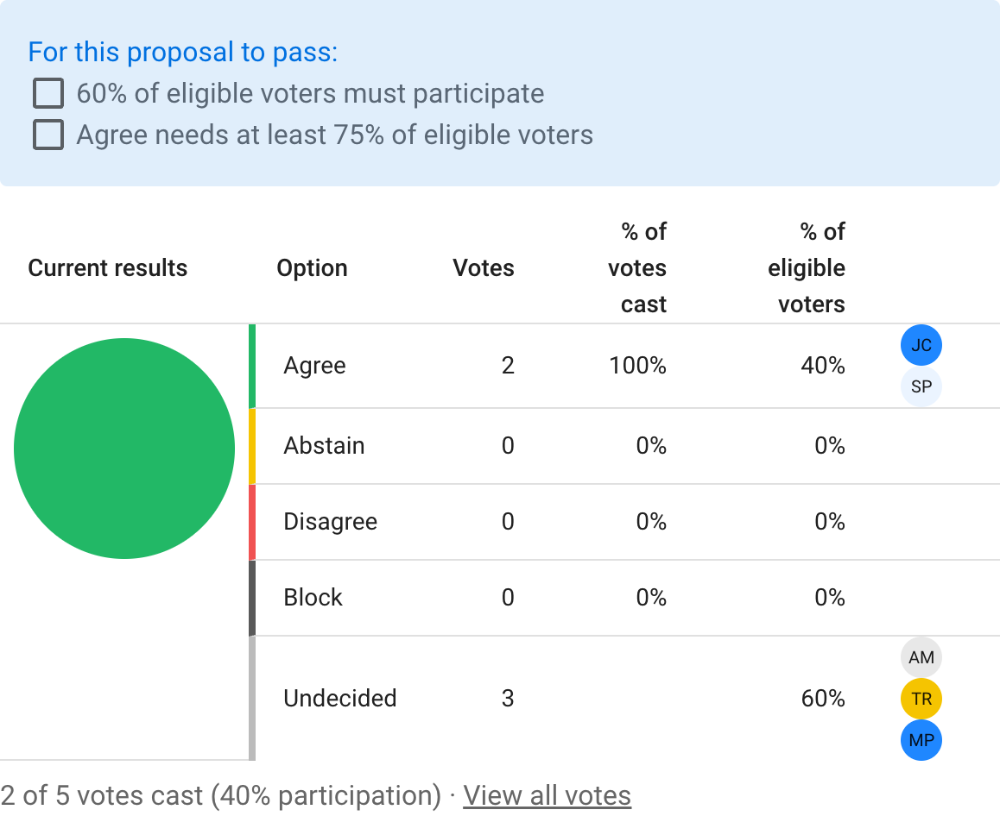
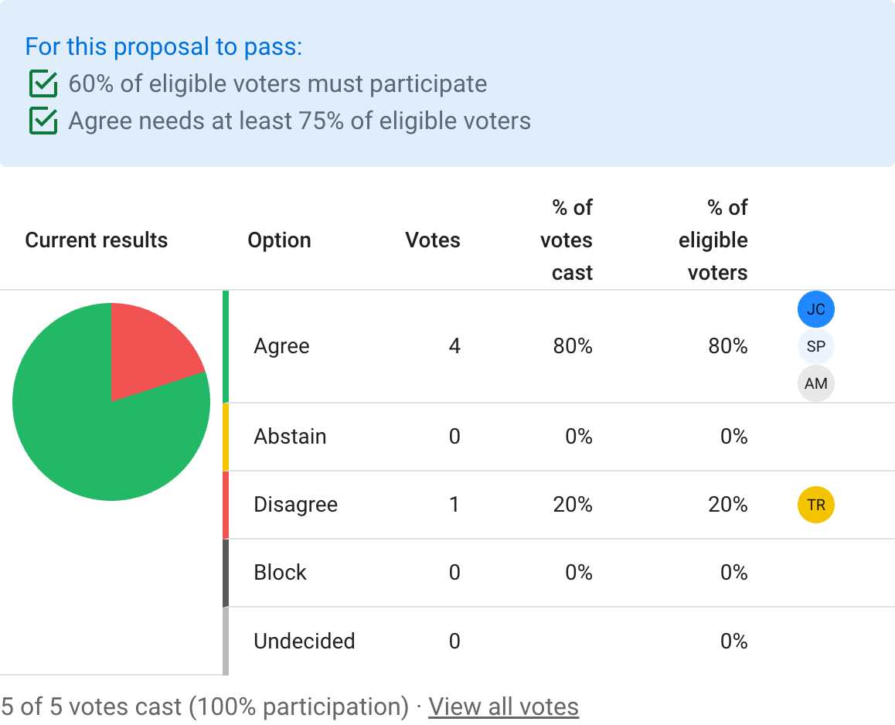

# Vote share requirements

Set a vote share requirement on an option when a proposal must receive a particular percentage of support, or remain below a particular percentage of opposition, to pass.

Vote share requirements can be combined with a [quorum](/en/user_manual/polls/quorum/) to require both sufficient participation and a particular distribution of votes.

When creating a proposal, select the edit icon beside an option.

## Eligible voters and votes cast

The percentage can be based on either **Votes cast** or **Eligible voters**.

**Eligible voters** means everyone who is able to vote in the proposal. **Votes cast** means only the votes that have been submitted.

A requirement of 75 percent agreement from eligible voters can pass only when at least 75 percent of all eligible voters vote for that option.

A requirement of 60 percent agreement from votes cast can pass when 60 percent of submitted votes support the option, regardless of overall turnout. Add a quorum when your process also requires a minimum level of participation.

## Different vote share requirements

A proposal can have requirements on more than one option. For example:

- Agreement must be at least 75 percent of eligible voters
- Abstention must be no more than 30 percent of votes cast
- Block must be no more than 0 percent of votes cast

You can also add requirements to a [poll template](/en/user_manual/polls/poll_templates/) so that new proposals created from the template use them by default.

## Detailed example

Oatmilk Cooperative is deciding whether to approve the budget for its six-week returnable bottle trial. Five people are eligible to vote.

Jamie uses the **Consent** proposal template, edits the Consent option, and enables its vote share requirement.

The cooperative's process requires at least 75 percent of eligible voters to support the proposal. Jamie sets the requirement to **At least 75% of Eligible voters**.

Jamie also sets a 60 percent quorum. Jamie and Samira vote in agreement. All submitted votes support the proposal, but they represent only 40 percent of eligible voters, so neither requirement has been reached.

Alex and Morgan then agree, while Taylor disagrees. All five people have voted, reaching the quorum, and four of five eligible voters agree. The 80 percent agreement exceeds the 75 percent vote share requirement, so both requirements show green check marks.

