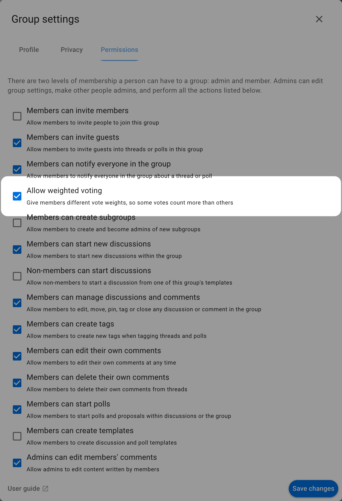
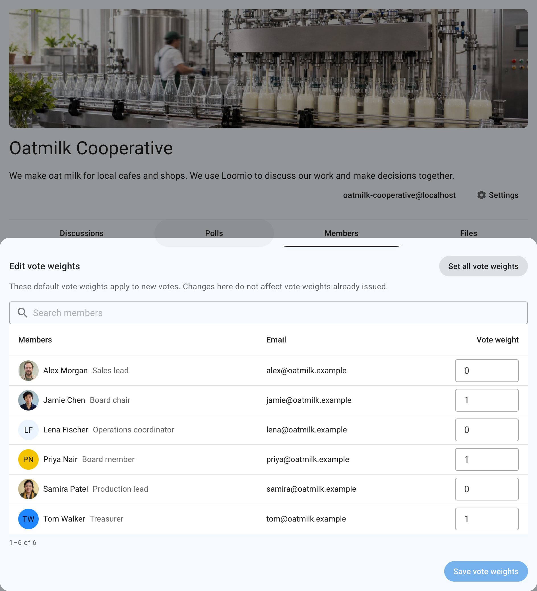
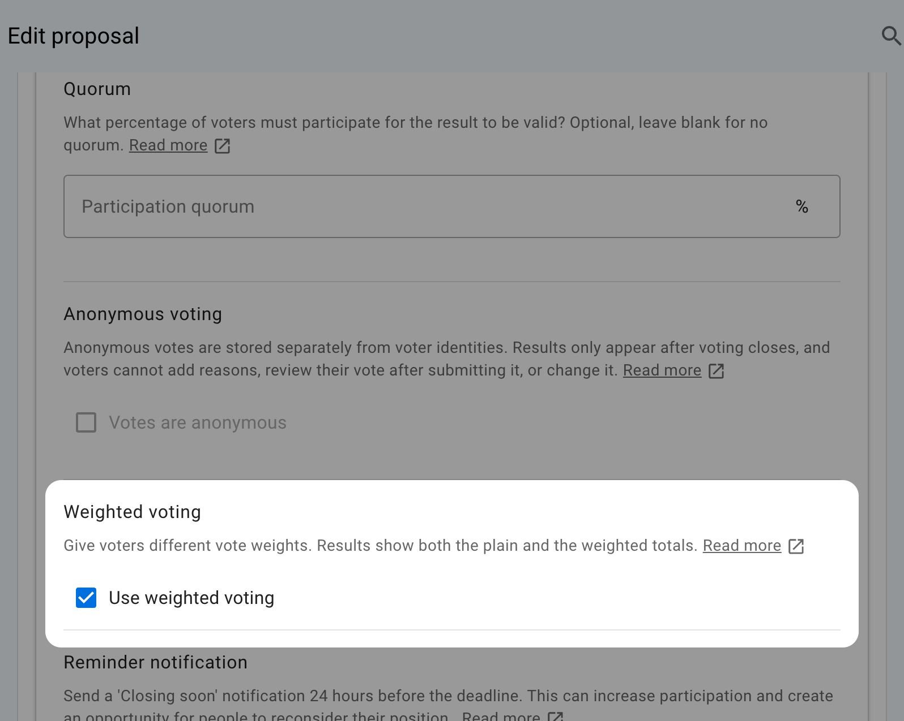
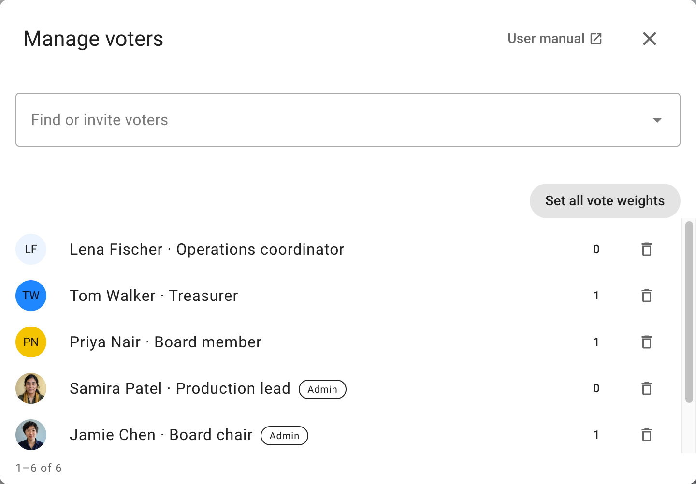
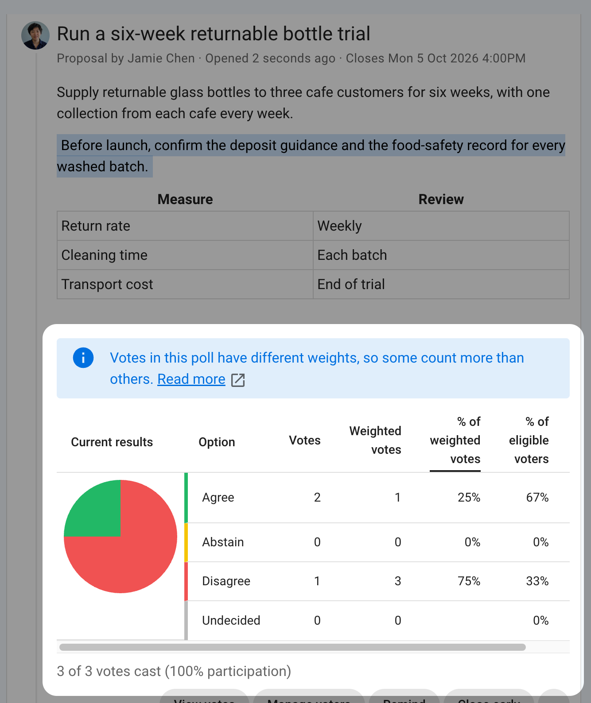

# Weighted voting

Weighted voting lets some votes count more than others. You can give each voter a different vote weight. For example:

- A housing community gives each property one vote. If a member represents three properties, their choice contributes three times as much to the score as a member representing one property.
- A team invites everyone to share their view, but gives formal voting weight only to designated voters. Others can vote with a vote weight of `0`, so their choices are recorded without adding to the result. The team can use different vote weights for a particular poll.
- A condominium assigns voting power according to ownership share. A person with a 2.33% share can be given a vote weight of `2.33`, while someone with a 0.5% share can be assigned `0.5`.

Vote weights can be `0` or greater and are stored to three decimal places. Values with more decimal places are rounded when saved. Loomio does not track which properties a person represents, who is authorized to vote for a property, or turnout by property. Check that a poll's voting method matches any rules about how many candidates a person may select; assigning vote weights alone does not define those rules.

## Allow vote weights in a group

A group admin can open **Group settings → Permissions** and select **Allow vote weights**. The setting is off by default. It lets group admins set default vote weights for members and lets poll coordinators turn on vote weights in new polls in that group. Polls that already use vote weights keep using them if the group setting is turned off later. Direct polls have no group setting; their coordinators can enable vote weights in each poll.

Vote weights are available for identified polls other than time polls and STV elections. Anonymous polls do not support them.

## Set members' vote weights

Open the group's **Members** page and select **Edit vote weights**. The editor lists current members 50 per page, with their avatar, email, membership title, and delegate status. Search by name or email to find someone in a large group. Enter vote weights in the table and select **Save vote weights** to save the vote weights you changed, including changes made on other pages or before a search. To give every current member the same vote weight, including members on other pages, select **Set all vote weights**, enter a value in the dialog, and save it. Admins can also edit one member's vote weight from that member's menu.

A member's vote weight is a default for new votes in weighted polls. Changing it does not alter vote weights already copied into a poll.

## Use vote weights in a poll

A poll coordinator can select **Use vote weights** in the poll's advanced settings, including after voting opens. In a group poll, the poll copies each group member's current vote weight when that person is added as a voter. Other invited people, including everyone in a direct poll, start with a vote weight of `1`. Turning vote weights off sets every vote weight in that poll back to `1`, so any vote weights changed for that poll are lost. Turning vote weights on again copies members' default vote weights; other voters get a vote weight of `1`. This also changes vote weights for votes already cast and recalculates the poll result.

Select **Manage voters** on the poll to open the voter management window. Use **Find or invite voters** to search current voters or add new ones, and use the page controls to browse larger lists. To adjust one voter's vote weight, select it beside their name, enter the new vote weight, and save. Changing the vote weight of a vote already cast updates the poll's result.

Select **Set all vote weights** at the top right of the voter list to update every current voter, including voters on other pages or outside the current search results. Choose **Set each member's default vote weight** to copy members' default vote weights, or **Set all vote weights the same** to enter one value for everyone. Voters without a current group membership get a vote weight of `1` when you copy member defaults. This also updates people who have already voted and recalculates the poll result. Direct polls offer only the one-value option because they have no group memberships.

The results table keeps its usual columns and adds the weighted result beside them:

- For proposals and other voting methods where each choice gives one vote, **Votes** counts the people who chose each option and **Weighted votes** adds up their vote weights. The percentage column becomes **% of weighted votes**.
- For dot votes, score polls, and ranked choice, **Points** shows the points given as if every vote weight were `1`, and **Weighted points** multiplies each voter's points by their vote weight. **% of weighted points** and **Weighted mean** also use the vote weights.

The chart shows the weighted result by default. Select a column heading such as **Votes** or **Weighted votes** to chart that measure instead; the table values stay visible. Anyone who can see the votes can also see each voter's vote weight.

## Example: votes and weighted votes

In this proposal, Jamie and Samira agree, while Alex disagrees. Jamie's vote weight is `0`, Samira's is `1`, and Alex's is `3`. All three votes are recorded, so **Agree** has two votes and **Disagree** has one. Their weighted votes are `1` for Agree and `3` for Disagree, so the result chart shows 25% Agree and 75% Disagree.

**Eligible voters** counts people, regardless of their vote weights. A voter whose vote weight is `0` is still eligible, and a vote they cast counts toward participation and quorum. For this example, Agree has two out of three eligible voters (about 67%), even though it has 25% of the weighted votes. A choice's **% of eligible voters** and **% of weighted votes** can therefore differ. The chart starts with the weighted votes; select **Votes** or **% of eligible voters** to see the result by people.
