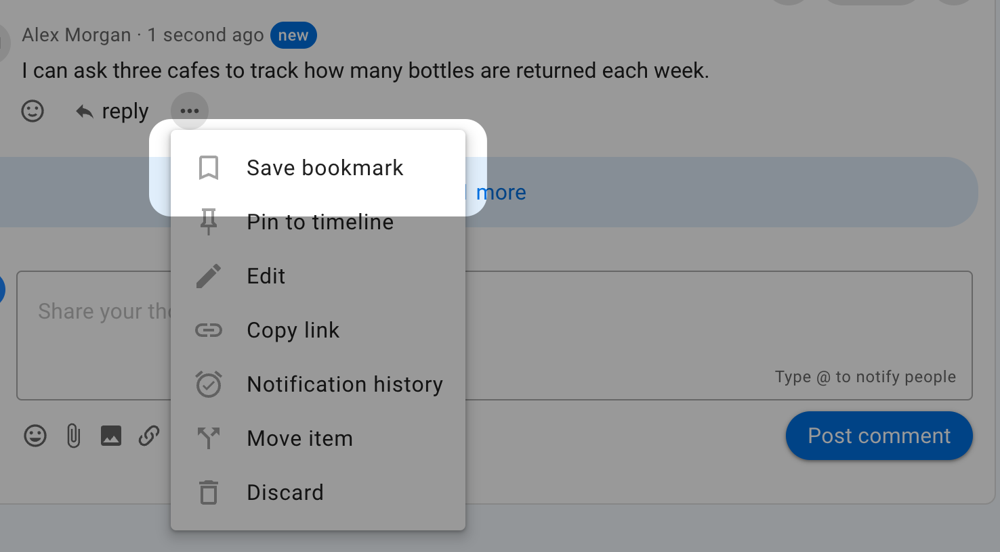
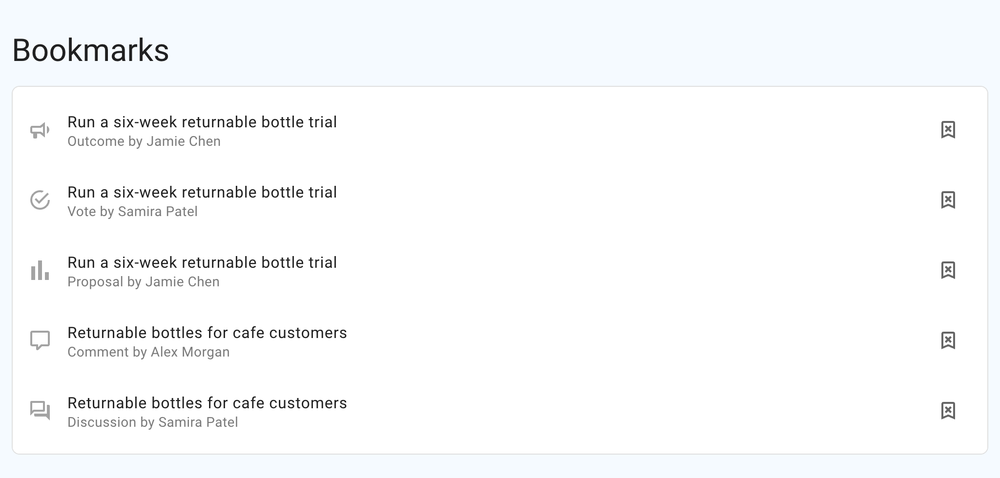

# Bookmarks

Bookmarks are a personal list of Loomio items you want to return to. Your
bookmarks are visible only to you and saving an item does not notify anyone
else.

You can bookmark:

- discussions
- comments
- proposals and polls
- votes
- outcomes

## Save a bookmark

Open the action menu for the item and select **Save bookmark**. The action menu
is usually shown as three dots. For a discussion, use the action menu near the
discussion title; for a comment, vote, proposal, poll, or outcome, use the menu
on that item.

## View your bookmarks

Open the sidebar and select **Bookmarks**. The number beside the link shows how
many bookmarks you have saved.

The Bookmarks page lists your most recently saved items first. Each row shows
the kind of item and its author. Select a row to return to the bookmarked item.

## Remove a bookmark

On the Bookmarks page, select the remove-bookmark button at the end of a row.
You can also open the bookmarked item's action menu and select **Remove
bookmark**.

Removing a bookmark affects only your personal list. You can save the item
again later.
