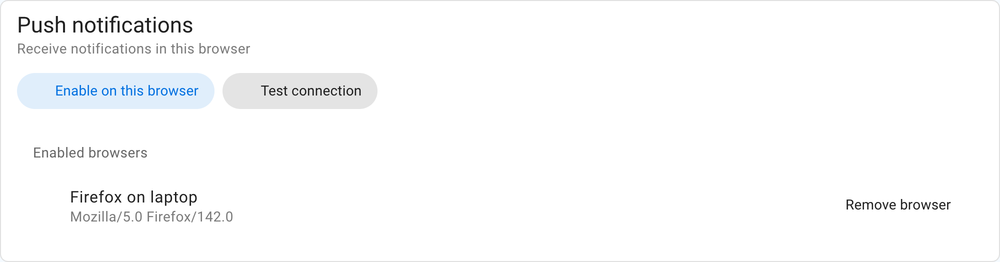
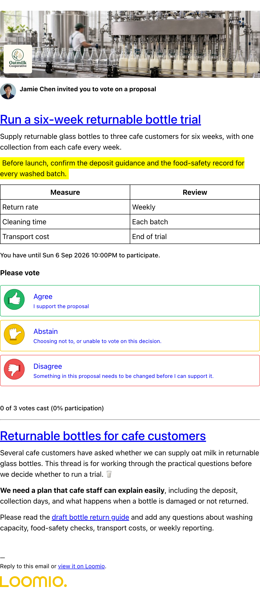
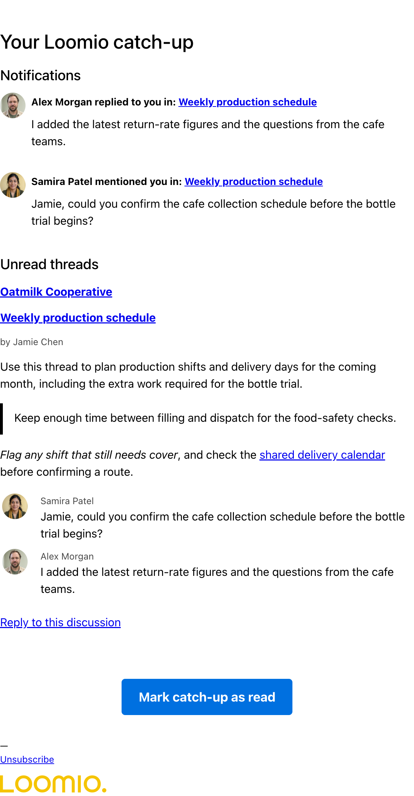
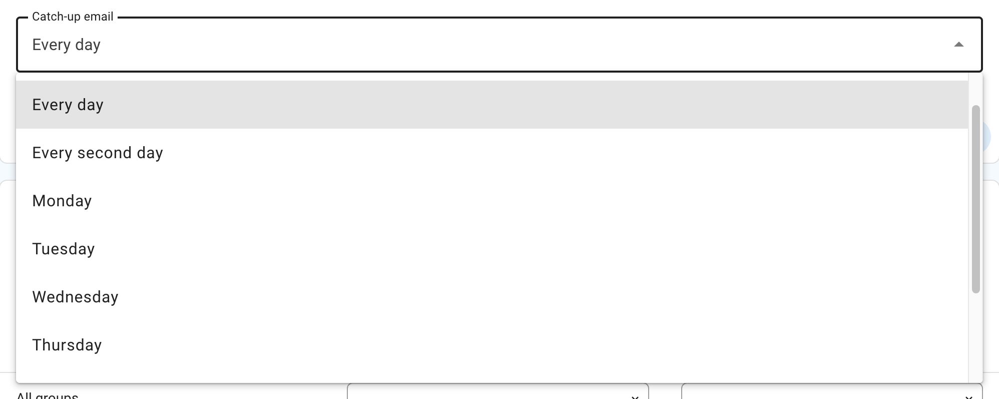

# Notifications

The notifications you receive from Loomio help you stay in touch with activity in your Loomio groups, be alerted to new discussions, polls, outcomes and when someone wants to get your attention.

## Default settings

New accounts start with these notification settings:

- **Email — When notified:** Loomio sends an immediate email when someone asks for your attention, such as by mentioning you, replying to you, or inviting you to participate
- **Catch-up email — Every day:** unseen notifications and unread activity that you have not already seen are collected into a daily catch-up
- **Push — When notified:** this is ready to use, but Loomio cannot send push notifications until you enable push in at least one browser
- **Newsletter — Off:** you only receive the newsletter if you choose to subscribe

These defaults apply when you join a group, and threads initially inherit their group's settings. You can change the defaults for future groups, override them for a particular group or thread, and choose different settings for email and push. Existing accounts keep their current settings.

## Notifications in Loomio

When you are notified, Loomio records the notification within the app and, by default, sends it by email.

The bell icon in the top-right is where notifications are accessed within the app; a number will display the number of notifications you have yet to read.

The notification list tells you when someone mentions you, invites you to vote, starts a discussion, or shares other activity that needs your attention. Select a notification to open the related discussion or poll.

## Push notifications

Push notifications are short messages displayed by your browser or operating system. They can alert you to activity that needs your attention when Loomio is open in another tab or is not open.

### How push delivery works

Each browser uses a push service to receive messages: Mozilla for Firefox, Google for Chromium-based browsers, and Apple for Safari. Loomio encrypts the notification for your browser subscription before sending it through that service. Delivery is usually prompt, but the browser, operating system, network connection, or push service can delay a message.

A push subscription belongs to one signed-in browser profile on one device. Private browsing windows and normal browsing windows use separate profiles. Enabling push on one does not enable it on the other.

### Enable push on a browser

1. Open **Notification settings** from your user menu.
2. In **Push notifications**, select **Enable on this browser**.
3. Allow notifications when your browser asks for permission.
4. Select **Test connection**. Loomio sends a test notification to every browser currently listed under **Enabled browsers**.

If you previously blocked notifications, open your browser's site settings and allow them before trying again. Push notifications require HTTPS and a browser that supports web push.

The Notification settings page lists every active browser subscription. Select **Remove browser** to stop delivery to a browser you no longer use. **Disable on this browser** removes the current browser, and signing out also disables push for the current browser.

### Choose which activity is pushed

After at least one browser is enabled, group and thread notification forms show a **Delivery method** dropdown with **Email**, **Push**, and **Email and push**. The push setting applies to all enabled browsers on your account, not only the browser where you change it.

For example, choose **Email and push**, set Email to **Catch-up only**, and set Push to **When notified** to receive immediate push notifications when someone asks for your attention while leaving other activity for your catch-up email.

## Email notifications

Loomio sends emails to keep you updated on the activity in your groups. The default settings assume that you don't have a habit of using Loomio regularly so are designed to ensure you can stay up to date by checking your emails.

Emails we send out include:

- A **Catch-up email** containing unseen notifications followed by recent activity you have not read. When action is needed, its subject highlights votes you still need to cast, people who mentioned you, or polls closing soon. Otherwise it uses **Yesterday on Loomio**, **Recently on Loomio**, or **Last week on Loomio**, depending on your chosen schedule.

- **Mention** and **Reply** notifications. If someone replies to a comment you wrote, or they write a comment and mention you in it, you'll get an email with what they wrote.

- Invitations to discussions and notification of polls or proposals. If someone wants to notify the group about a new decision or discussion, they can select everyone or just some people in the group to notify. Also be aware of **poll closing soon** and **outcome** notifications.

When a discussion email says that replies are accepted, you can reply directly from your email and your message will be posted into the Loomio discussion.

Poll invitation emails show the poll and its response options, but selecting an option opens Loomio in your browser to complete the vote. You may need to sign in or confirm your account. The catch-up email cannot accept replies; open the linked discussion or poll first.

## Notification settings

To see and change notification settings, go to **Notification settings** under your user profile on the sidebar menu.

If the sidebar is closed, click on the menu icon (**☰**) to open it.

The page contains settings for push notification devices, the catch-up email, and email and push delivery for each group.

### Catch-up email

The catch-up email provides a regular overview of activity without emailing you about every event or requiring you to check Loomio each day.

It shows your unseen notifications first, followed by unread discussions and standalone polls grouped by group. Each notification includes its related comment, discussion description, poll details, outcome, or shared vote when available. The unread section can include new discussions, comments, votes, and edits. Direct discussions and threads you have joined as a guest are included when they contain unread activity.

Loomio does not send a summary when there are no unseen notifications or unread threads from the relevant period.

New accounts start with a daily catch-up. Choose how often you want to receive it:

- **Never** to turn off the summary
- **Every day** for activity from approximately the previous 24 hours
- **Every second day** for activity from approximately the previous two days
- a weekday to receive a weekly summary on that day

The summary is sent in the morning according to the time zone in your Loomio profile.

Select **Mark catch-up as read** in the email to mark its notifications and topic activity as read in Loomio. Opening or previewing the email does not mark anything as read.

The catch-up email is not a discussion-specific email, so do not reply to it. Open a discussion or poll from the summary before commenting or replying.

## Group notification settings

You can configure how much activity you receive from each group by email, push, or both. These settings belong to you; group administrators cannot change them.

Notification settings for each specific group are found in your Loomio group. To find them:

- Click on your group page
- Open the notification settings for the group

The form is titled **Group notification settings** and asks **How do you want to stay updated?** If push is enabled on at least one browser, use the **Delivery method** dropdown to choose **Email**, **Push**, or **Email and push**, then choose a setting for each selected channel. Otherwise, the form shows email choices only. When you enable push for the first time, it starts at **When notified**:

- **Catch-up only** includes activity from the group in your catch-up rather than sending an immediate email or push
- **When notified** sends an email or push when someone asks for your attention and includes the rest in your catch-up; this is the default
- **All activity** sends an email or push for every new comment, vote, thread, poll, and outcome

If your catch-up is set to **Never**, **Catch-up only** is replaced by **No email updates** or **No push updates**.

When Email and push is selected, email and push can use different settings.

You can apply a particular setting to all of your groups by checking **Apply to all groups**.

## Thread notification settings

To change notification settings for an individual thread, open the notification control in the thread sidebar.

The form is titled **Thread notification settings** and uses the same **Catch-up only**, **When notified**, and **All activity** choices. Thread settings override your group settings for that thread. Push choices appear after push is enabled on at least one browser. When the catch-up is disabled, the form uses **No email updates**, and the thread sidebar shows **In-app only** when email is not enabled.

>[!Note]
>The settings changes in Thread notifications are only for the particular thread you have open.  Click **Change notifications for group** to change the default settings for all threads.

## Turn off external notifications

To stop email and push messages for group and thread activity, go to [Notification settings](/email_preferences), set the catch-up to **Never**, and choose **No email updates** and **No push updates**. Activity remains available when you open the app.

