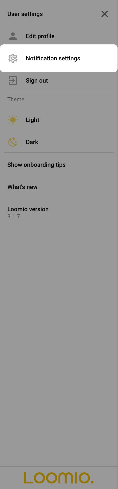
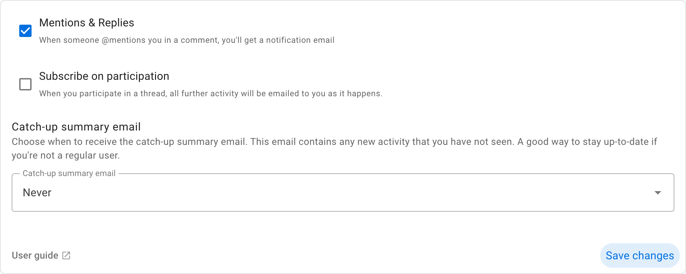
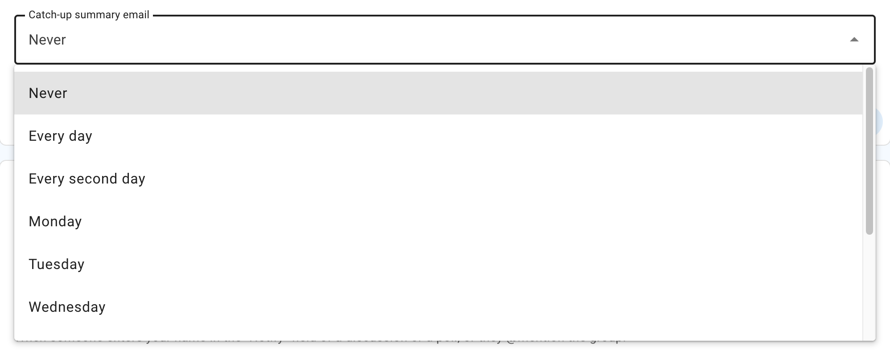
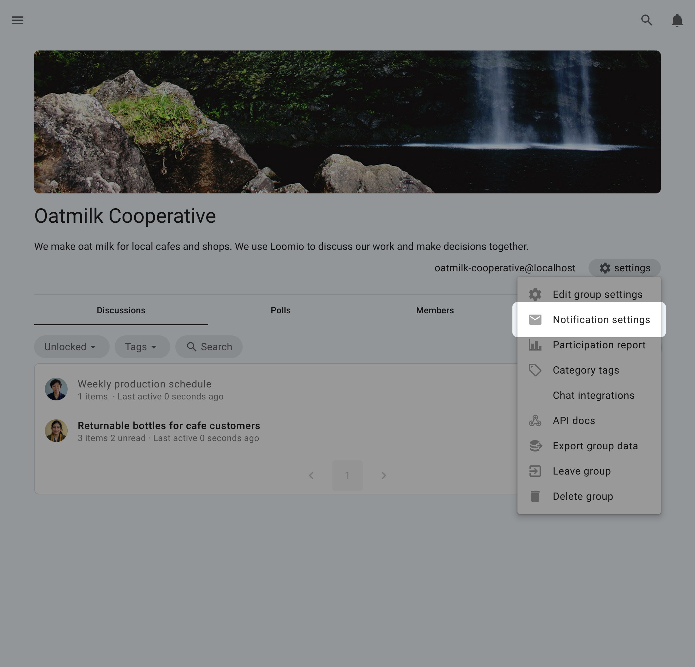
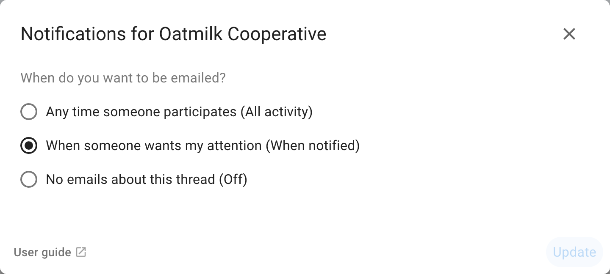
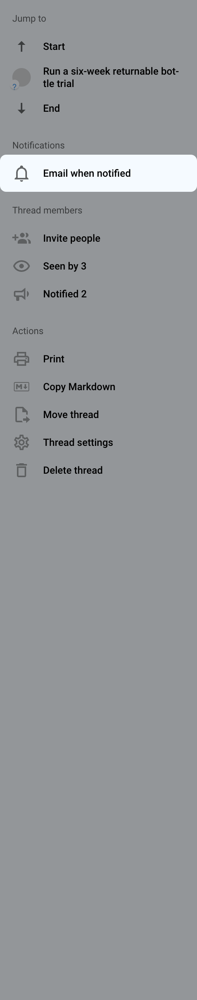
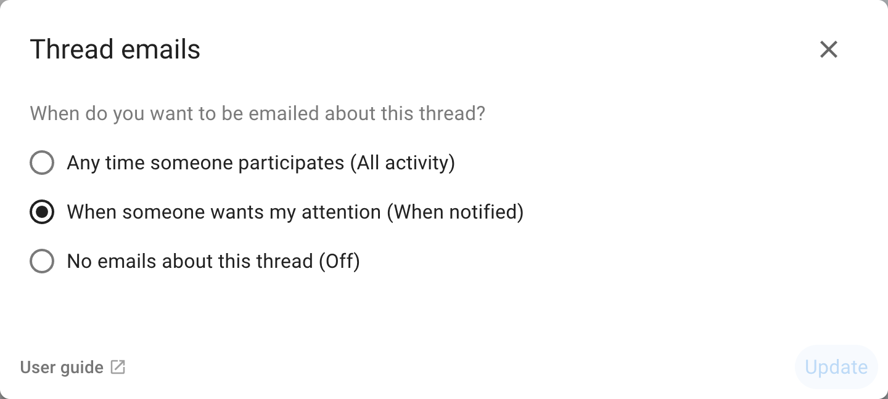
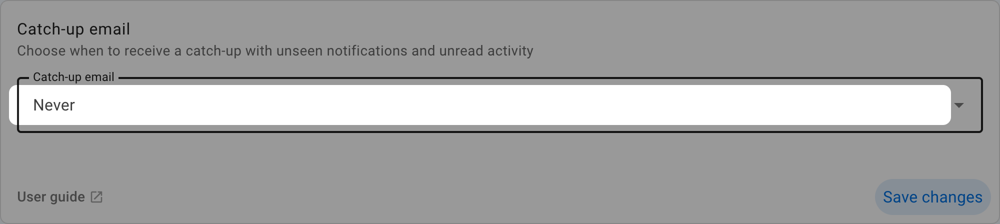
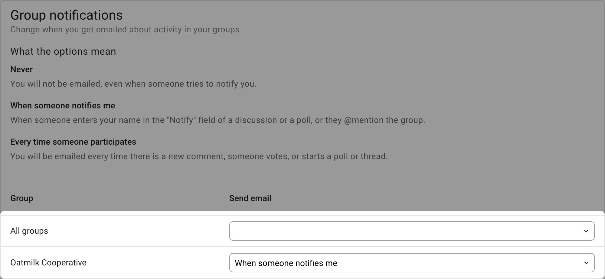

# Notifications

The notifications you receive from Loomio help you stay in touch with activity in your Loomio groups, be alerted to new discussions, polls, outcomes and when someone wants to get your attention.

The default notification settings alert you to important activity in your groups by email. You can instead receive push notifications, or use both channels.

The default settings work for most people.  Change notification settings to suit the way you work. 

## Overview video

<iframe width="100%" height="380px" src="https://www.youtube-nocookie.com/embed/0Mb2_D74ktM?start=2?rel=0" frameborder="0" allowfullscreen></iframe>

## Notifications in Loomio

When you are notified, Loomio records the notification within the app and, by default, sends it by email.

The bell icon in the top-right is where notifications are accessed within the app; a number will display the number of notifications you have yet to read.

The notification list tells you when someone mentions you, invites you to vote, starts a discussion, or shares other activity that needs your attention. Select a notification to open the related discussion or poll.

## Push notifications

Push notifications display new activity through your browser or operating system, including when Loomio is not open. Go to **Notification settings** and choose **Enable on this browser**. Your browser will ask for permission.

Permission applies separately to each browser and device. The Notification settings page lists enabled browsers so you can remove one that you no longer use. Signing out disables push notifications for the current browser.

If you previously blocked notifications, use your browser's site settings to allow them before enabling push in Loomio. Push notifications require HTTPS and may not be available in every browser.

## Email notifications

Loomio sends emails to keep you updated on the activity in your groups. The default settings assume that you don't have a habit of using Loomio regularly so are designed to ensure you can stay up to date by checking your emails.

Emails we send out include:

- A **Catch-up summary email** containing recent activity you have not read. Its subject is **Yesterday on Loomio**, **Recently on Loomio**, or **Last week on Loomio**, depending on your chosen schedule.

- **Mention** and **Reply** notifications. If someone replies to a comment you wrote, or they write a comment and mention you in it, you'll get an email with what they wrote.

- Invitations to discussions and notification of polls or proposals. If someone wants to notify the group about a new decision or discussion, they can select everyone or just some people in the group to notify. Also be aware of **poll closing soon** and **outcome** notifications.

- Discussion updates. If **subscribe on participation** is checked, then after you comment or vote within a discussion, you'll be emailed any further activity.

When a discussion email says that replies are accepted, you can reply directly from your email and your message will be posted into the Loomio discussion.

Poll invitation emails show the poll and its response options, but selecting an option opens Loomio in your browser to complete the vote. You may need to sign in or confirm your account. The Catch-up summary cannot accept replies; open the linked discussion or poll first.

## Notification settings

To see and change notification settings, go to **Notification settings** under your user profile on the sidebar menu.

If the sidebar is closed, click on the menu icon (**☰**) to open it.

The page contains settings for push notification devices, notification emails, the Catch-up summary, and email and push delivery for each group.

### Mentions & Replies

Enabling this setting means when someone wants to get your attention, they can @mention your name in a comment, which will notify you. We recommend you leave this setting on, so you'll get an email when this happens. The default setting is 'on'.

### Subscribe on participation

Enabling this setting means when you participate in a thread, all further activity will be emailed to you immediately.  If it is an active thread, you may receive many emails. The default setting is off.

### Catch-up summary email

The Catch-up summary email provides a regular overview of unread activity without emailing you about every event or requiring you to check Loomio each day.

It groups discussions and standalone polls by group, and can include new discussions, comments, votes, and edits. Direct discussions and threads you have joined as a guest are included when they contain unread activity.

Loomio does not send a summary when there is no unread activity from the relevant period.

Choose how often you want to receive it:

- **Never** to turn off the summary
- **Every day** for activity from approximately the previous 24 hours
- **Every second day** for activity from approximately the previous two days
- a weekday to receive a weekly summary on that day

The summary is sent in the morning according to the time zone in your Loomio profile.

Opening the email normally marks the activity included in it as read in Loomio. Some email clients block the small image used to do this; in that case, the activity remains unread until you open it in Loomio.

The Catch-up summary is not a discussion-specific email, so do not reply to it. Open a discussion or poll from the summary before commenting or replying.

## Group notification settings

You can configure how much activity you receive from each group by email, push, or both. These settings belong to you; group administrators cannot change them.

Notification settings for each specific group are found in your Loomio group. To find them:

- Click on your group page
- Open the notification settings for the group

First choose **Email**, **Push**, or **Email and push**. Then choose how much activity to receive through each selected channel:

- **All activity** sends every new comment, vote, thread, poll, and outcome
- **When notified** sends activity when someone asks for your attention, such as an invitation or group mention; this is the default
- **Muted** sends no messages through that channel; notifications that record important activity remain available in Loomio

When Email and push is selected, email and push can use different settings.

You can apply a particular setting to all of your groups by checking **Apply to all groups**.

## Thread notification settings

To change notification settings for an individual thread, open the notification control in the thread sidebar.

Choose **Email**, **Push**, or **Email and push**, then set each selected channel to **All activity**, **When notified**, or **Muted**. Thread settings override your group settings for that thread. The thread sidebar lists the effective email and push settings separately, or shows **Off** when both are muted.

>[!Note]
>The settings changes in Thread notifications are only for the particular thread you have open.  Click **Change notifications for group** to change the default settings for all threads.

## Turn off external notifications

To stop email and push messages for group and thread activity, go to [Notification settings](/email_preferences) and set both channels to **Muted**. Important activity can still create notifications inside Loomio, and the Catch-up summary remains a separate setting.

