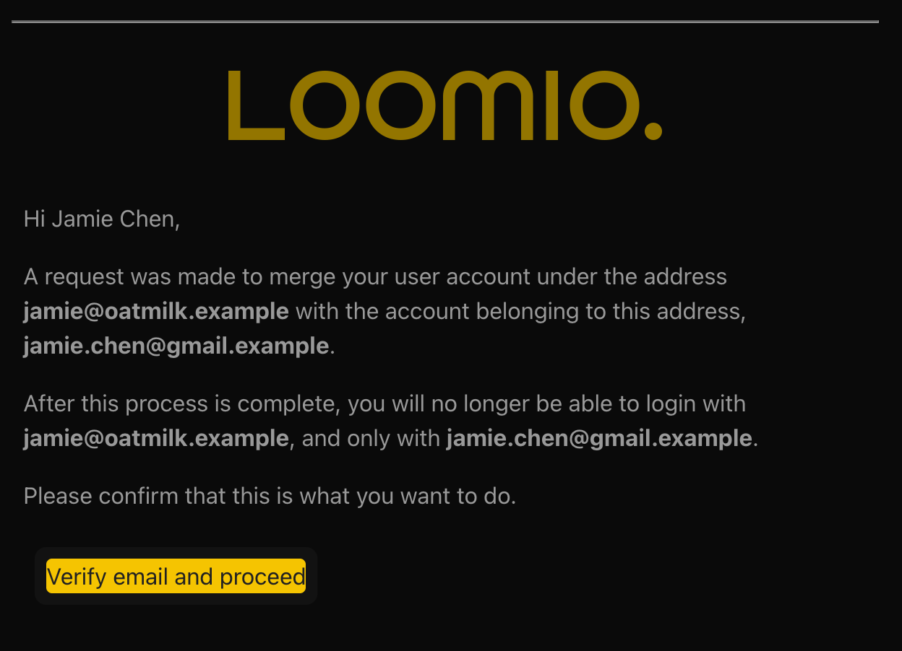
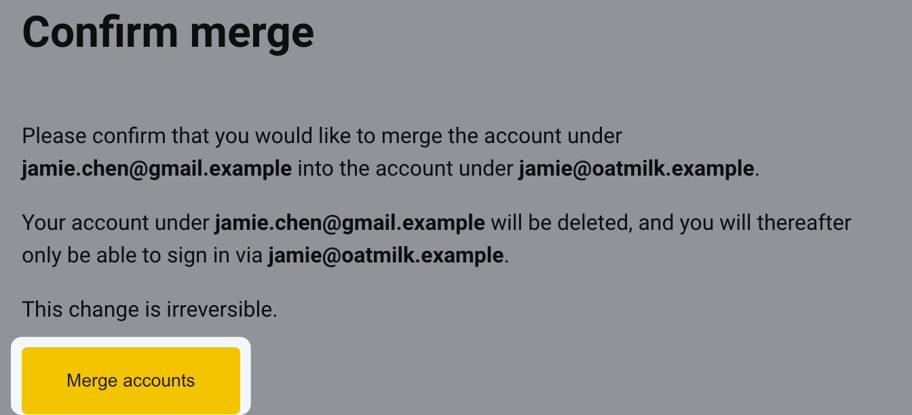

# Merge accounts

Merge two Loomio accounts when each account uses a different email address and you want to continue with one account.

Before you begin, decide which account you want to keep:

- The **account to keep** is the account whose email address and profile you will use after the merge
- The **account to retire** is the account you sign in to first. Its email address will no longer work for signing in after the merge

You need access to both accounts and to the email address of the account you want to keep.

> [!WARNING]
> Merging accounts is irreversible. Check the source and target email addresses carefully before the final confirmation.

## Start the merge

1. Sign in to the **account you want to retire**.
2. Open the sidebar, select your name, and select **Edit profile**.
3. In the **Email** field, enter the email address of the **account you want to keep**, then select **Merge accounts**. Loomio does not confirm whether an account exists at an address because that information is private.

4. Enter the address of the account you want to keep and select **Send verification email**. Loomio always shows the same confirmation and signs you out. If an account uses that address, Loomio sends it the verification email.

## Verify the account you want to keep

5. Open the verification email sent to the address of the account you want to keep and select **Verify email and proceed**.

6. Sign in as the account you want to keep if Loomio asks you to sign in.
7. On the **Confirm merge** page, check both email addresses again. Select **Merge accounts** to complete the merge.

## What happens after the merge

The account you keep remains your Loomio identity and sign-in account. Group memberships and activity from the retired account, including discussions, comments, polls, and votes, are reassigned to the account you keep. Where both accounts already belong to the same group, the existing membership for the account you keep remains.

The retired account is deleted and its email address can no longer be used to sign in. Loomio sends a confirmation email to the address of the account you kept when the merge is complete.
