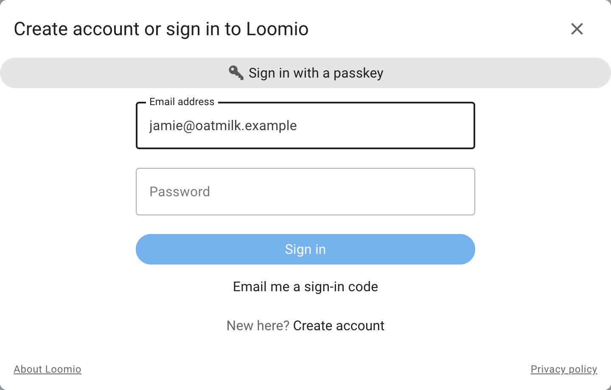
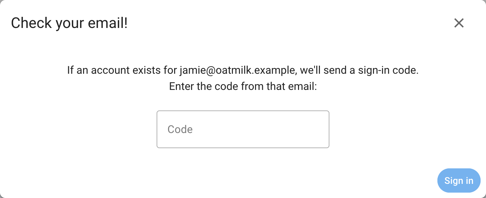

# Signing in

Loomio supports sign-in by email, an optional password, and organization
single sign-on when it has been configured for the Loomio instance. Members do
not need to remember a password to participate.

## Start signing in

Select **Sign in**, enter the email address used for your Loomio account, then
select **Continue with email**.

If your account has a password, you can enter it or select **Forgot password**
to receive a sign-in email. If your account does not have a password, select
**Send sign in email**.

For privacy, use the same email address that received your group invitation.
If you have accounts under more than one address, you can [merge your
accounts](/en/user_manual/users/merge_accounts).

## Get a sign-in link or code

After you request a sign-in email, Loomio sends a one-time link and a six-digit
code to your email address.

Either:

- select the link in the email, then confirm the account shown by Loomio; or
- return to the sign-in form, enter the six-digit code, and select **Sign in**

Sign-in links and codes normally expire after 24 hours and cannot be reused.
If one expires, request another sign-in email. Check your spam folder if the
message does not arrive, and make sure you entered the address associated with
your account.

After signing in with a code, Loomio may offer to set a password. This is
optional; you can continue using email links and codes.

## Single sign-on

Loomio supports SAML and OAuth single sign-on when configured by the instance
operator. A configured provider appears as a button on the first sign-in
screen, using a name chosen by the organization.

Select the organization sign-in button and authenticate with your identity
provider. If an existing Loomio account has the same email address, Loomio
links the sign-in identity to that account. An organization may also manage
your name and email through its identity provider, in which case those fields
cannot be edited in your Loomio profile.

The available providers and whether single sign-on is required depend on the
Loomio instance used by your organization.

## Sign out

Open the sidebar, select your name, then select **Sign out**. On a shared
computer, sign out when you finish rather than closing only the browser tab.
